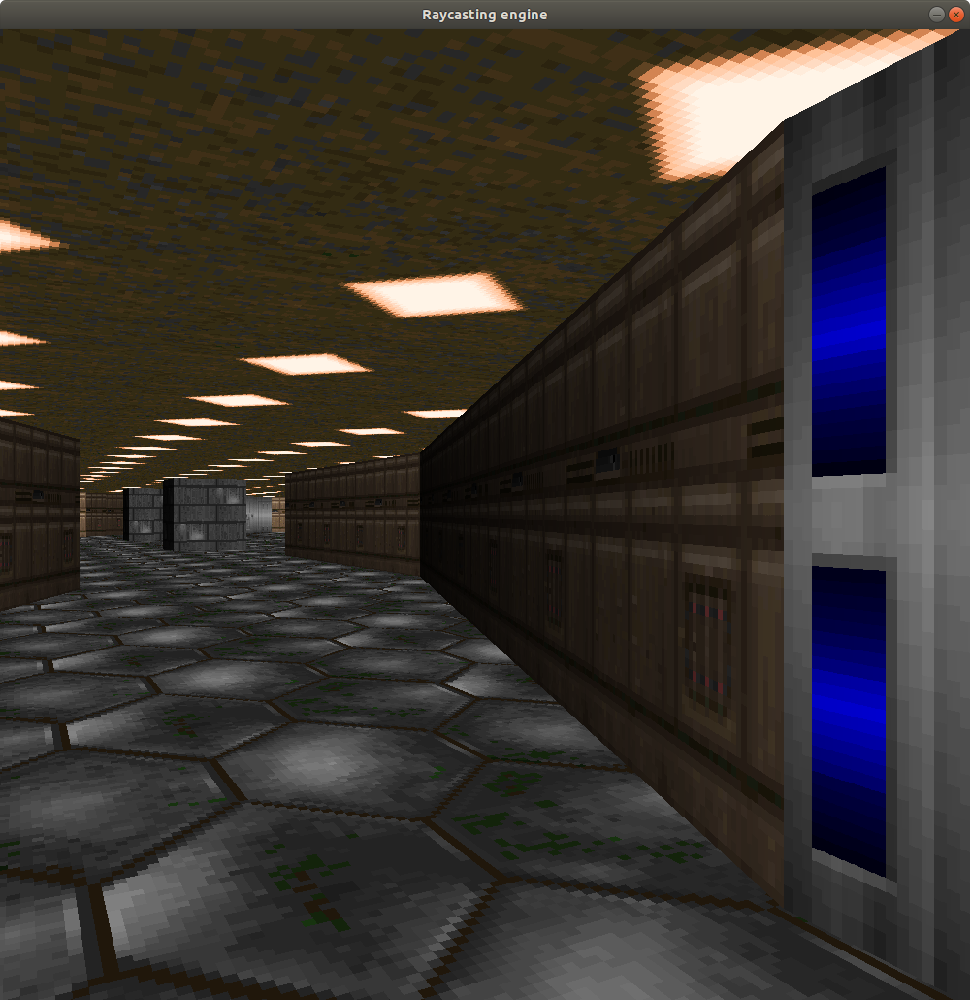

# Simple raycasting
The rendering of the walls is represented by lines in the plane with with different textures and colors.
Project based on SDL2 SDL2_image libraries, check whether the libraries is available on your system.

<figure>
    
    
</figure>
